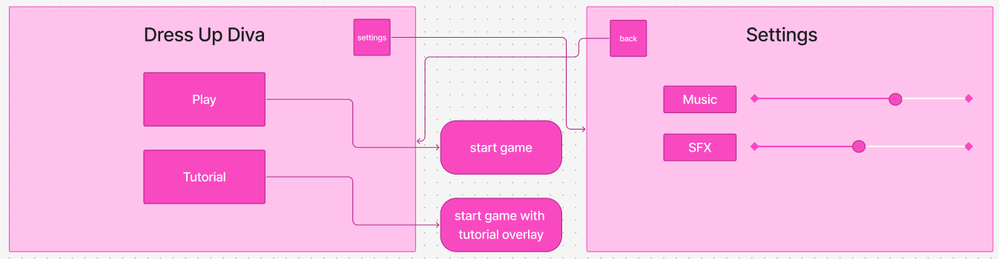

# ATLS4140-dress-up

- Base functionality adapted from [I Made a Dress Up Game in Godot](https://www.youtube.com/watch?v=Z5UFD01JbMs) and [Godot Dress Up Game Tutorial Part 2](https://www.youtube.com/watch?v=toEFOpF91Uw)
- Particle system from [Youtube](https://www.youtube.com/watch?v=4WGJxQ61G8I&pp=ygUYZ29kb3QgcGFydGljbGUgc3lzdGVtIDJk)
- Cursor code from [Youtube](https://www.youtube.com/watch?v=CBKtQDQs1Tc)
- Click sound from [Open Game Art](https://opengameart.org/content/zippo-click-sound)
- Background music by [Nicraftin](https://www.youtube.com/watch?v=A3ubpvoz7aM)

Art, background, and cursor design by Jadynn

Juice!
- Click Sound (Sage - 45 minutes)
- Custom Art (Jadynn - 5.5 hours)
- Music (Jadynn - 20 mins)
- Custom Cursor (Jadynn - 45 mins)
- Particle System (Jadynn)
- 'Done' Button with screenshot page (Sage - 2.5 hours)

## Menu Development: Sage and Evie

- wireframe (Sage - 30 min)
- main menu (Sage - play button took 3 hours (lots of bugs ><), tutorial overlay took 3 hours)
- settings and back buttons (Evie - about 3 hours! pro-tip, don't work in decibels when it comes to audio accessibility settings, you might accidentally set the music to 100db)
